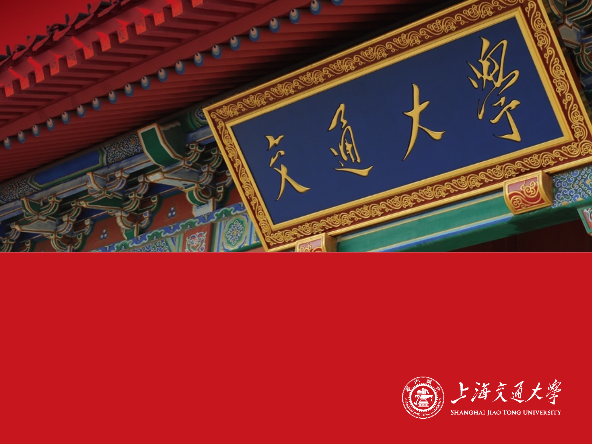

<!--
_paginate: false
_class: first
-->



# 上海交通大学PPT模板

主讲人姓名

2019年11月

---
<!--
_paginate: false
_class: second
-->


# 标题页第二版以及应用实例

主讲人姓名

2019年11月


---

## 急急流年，滔滔逝水

**波斯***诗人*`峨谟伽耶姆`的四行诗恰好说出了我们的感受：

> Into the Universe, and why not knowing, 
> Nor Whence, like water willy-nilly flowing: 
> And out of it, as wind along the waste, 
> I know not weither willy-nilly blowing.


- 来如流水兮逝如风，不知何处来兮何所终！

1. 到头这一身，难逃那一日。受用了一朝，一朝便宜。
2. 百岁光阴，七十者稀。急急流年，滔滔逝水。


```python
import timeflow as tf
print("了生死")
```

Powered By [Marp](https://marp.app/)

---

## 测试标题

**Marp**

交大学术等线幻灯模板

欢迎大佬调教


---

<!--
_paginate: false
-->


